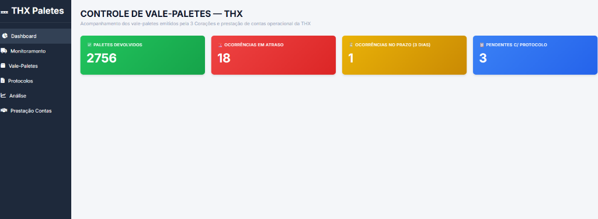
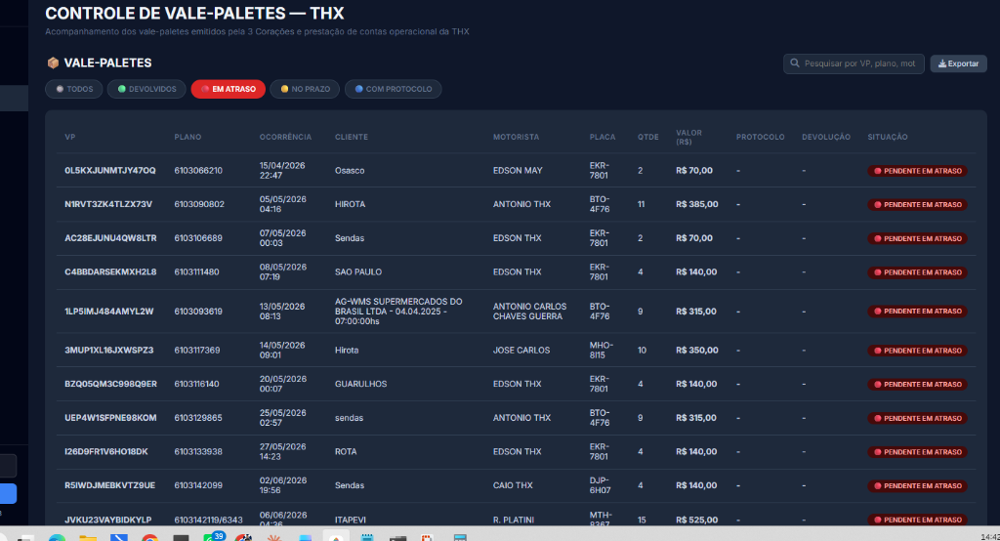
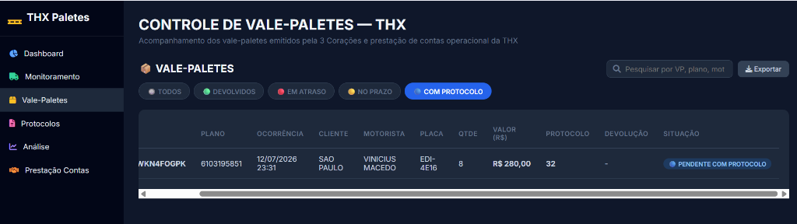
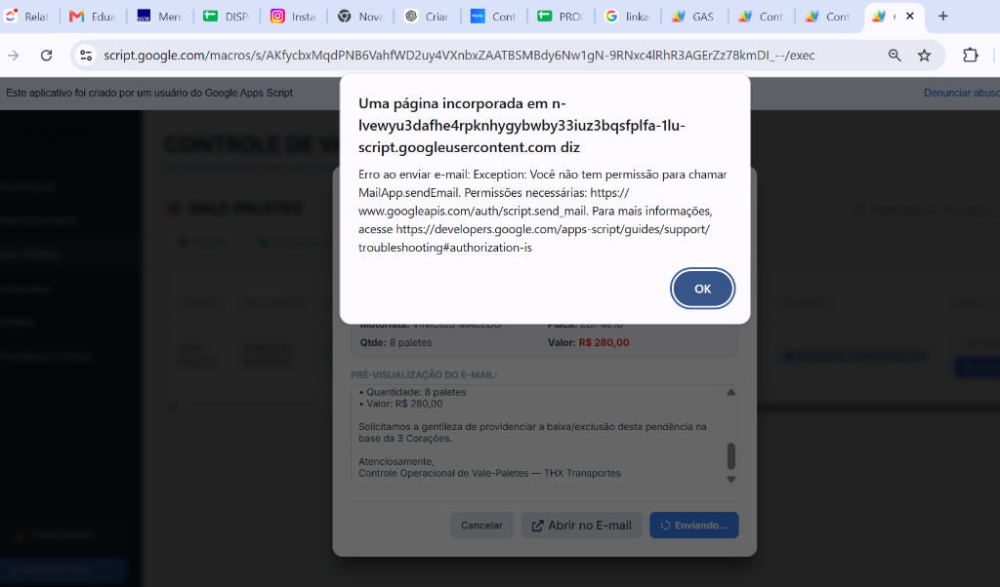
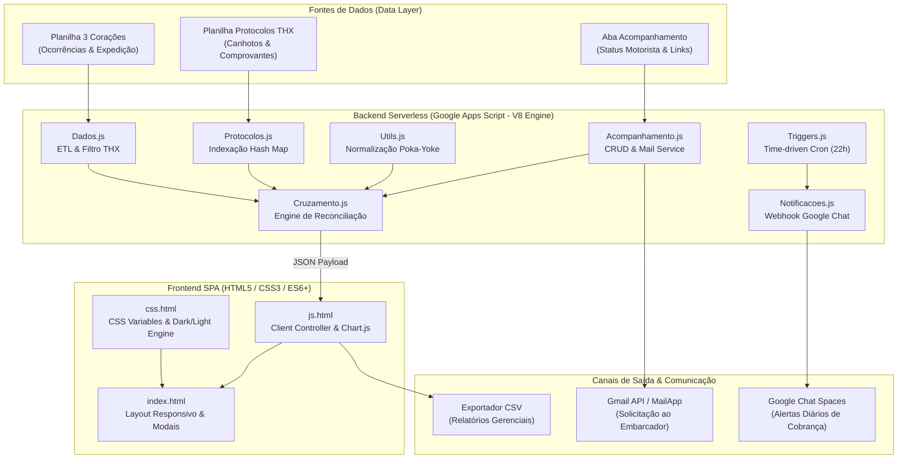

<div align="center">

# 📦 THX Paletes — Enterprise Flow & Pallet Asset Governance System
### Reconciliação Documental Automatizada, Gestão de Passivo Financeiro e Auditoria Logística

[](https://developers.google.com/apps-script)
[](https://developer.mozilla.org/pt-BR/docs/Web/JavaScript)
[](https://www.python.org/)
[](https://developers.google.com/sheets/api)
[](https://www.chartjs.org/)
[](#-engenharia-de-processos-lean-six-sigma--teoria-das-restrições-toc)
[](#)

<p align="center">
  <b>Sistema serverless corporativo de conciliação de fluxo reverso de ativos (Paletes PBR), desenvolvido para blindagem financeira, auditoria documental em tempo real e automação de cobranças e baixas entre transportadora (THX) e embarcador (3 Corações).</b>
</p>

</div>

---

## 📌 Sumário Executivo
1. [O Desafio de Negócio & Contexto Operacional](#-o-desafio-de-negócio--contexto-operacional)
2. [Galeria da Interface & Recursos em Operação](#-galeria-da-interface--recursos-em-operação)
3. [Engenharia de Processos: Lean & Teoria das Restrições (TOC)](#-engenharia-de-processos-lean-six-sigma--teoria-das-restrições-toc)
4. [Arquitetura de Dados & Pipeline Tecnológico](#-arquitetura-de-dados--pipeline-tecnológico)
5. [Diferenciais de Engenharia de Software](#-diferenciais-de-engenharia-de-software)
6. [Regras de Negócio e Matriz de Decisão](#-regras-de-negócio-e-matriz-de-decisão)
7. [Deploy, CI/CD Local e Configuração](#-deploy-cicd-local-e-configuração)
8. [Governança e Responsável Técnico](#-governança-e-responsável-técnico)

---

## 💼 O Desafio de Negócio & Contexto Operacional

Na logística de bens de consumo (FMCG), paletes padrão **PBR (1.000 x 1.200 mm)** representam ativos circulantes de alto valor unitário e risco permanente de passivo:

* **Assimetria Operacional:** A transportadora (**THX**) não emite os vale-paletes; eles são emitidos unilateralmente pela contratante (**3 Corações**) na expedição. A THX é responsável pela custódia do palete durante o transporte e pela comprovação da devolução no cliente final.
* **O Risco Financeiro:** Cada palete não comprovado ou retido gera um débito automático contratual de **R$ 35,00 por unidade**. Em frotas com milhares de paletes em giro, o delay de conferência gerava exposição a passivos ocultos de dezenas de milhares de reais.
* **A Restrição Documental:** O motorista frequentemente devolve o palete físico no cliente e obtém um canhoto/protocolo, porém a baixa oficial no sistema do embarcador sofria com o lead time de conferência manual entre planilhas e e-mails dispersos.

**Solução:** Criação de um Web App autônomo e resiliente que integra a base do embarcador à base de protocolos da transportadora, calcula o risco financeiro em tempo real e oferece ferramentas de intervenção e baixa instantânea.

---

## 🖥️ Galeria da Interface & Recursos em Operação

Demonstração prática dos módulos do sistema projetados com foco em **Gestão Visual (Andon)**, ergonomia de dados e velocidade de resposta operacional:

| 📊 Painel Executivo & Quantificação de Passivo | 🌙 Gestão Operacional & Tabela Dinâmica (Dark Mode) |
| :---: | :---: |
|  |  |
| **KPIs Críticos em Tempo Real:**<br/>• Volume de paletes devolvidos.<br/>• Ocorrências no prazo de segurança de 72h.<br/>• Alerta vermelho para ocorrências em atraso.<br/>• **Cálculo instantâneo do passivo financeiro em R$** (`Qtde × R$ 35,00`). | **Controle Fino de Tráfego:**<br/>• Filtros instantâneos por status com badges dinâmicos.<br/>• Barra de busca global multi-colunas (*fuzzy search* no client).<br/>• **Status do Motorista editável inline** (🟢 Ativo / 🔴 Inativo).<br/>• **Campo para colar link de tratativa** persistido em banco. |
| 🔍 **Auditoria & Pareamento de Protocolos** | ✉️ **Workflow de Baixa com 1 Clique (Integração E-mail)** |
|  |  |
| **Conciliação Algorítmica:**<br/>• Varredura matricial em O(N) buscando correspondência por número de VP ou número do Plano de Viagem.<br/>• Identificação imediata de documentos já localizados com comprovante. | **Desembaraço com 1 Clique:**<br/>• Disparo de e-mail formal pré-formatado para o responsável (`luizhenrique@3coracoes.com.br`).<br/>• Remetente corporativo com cópia e assinatura oficial de Kleber Costa.<br/>• Botão direto para abertura no Gmail com marcação automática de auditoria (`Solicitado ✅`). |

---

## 🎯 Engenharia de Processos: Lean Six Sigma & Teoria das Restrições (TOC)

O sistema não foi concebido como um simples visualizador de dados, mas como uma aplicação prática de metodologias industriais e de logística enxuta:

```
                  ┌─────────────────────────────────────────────────────────────┐
                  │                 TEORIA DAS RESTRIÇÕES (TOC)                 │
                  └──────────────────────────────┬──────────────────────────────┘
                                                 │
                   GARGALO IDENTIFICADO: Lead Time de Reconciliação Documental
                                                 │
         ┌───────────────────────────────────────┴───────────────────────────────────────┐
         ▼                                                                               ▼
┌─────────────────────────────────┐                             ┌─────────────────────────────────┐
│     BUFFER MANAGEMENT (72H)     │                             │      ELEVAÇÃO DA RESTRIÇÃO      │
│  Classificação de risco temporal│                             │  Automação de cobrança diária   │
│  🟡 0-72h: Janela de segurança  │                             │  (Google Chat Webhooks) e fluxo │
│  🔴 >72h: Atraso & Cobrança     │                             │  de baixa direta com 1 clique   │
│  🔵 Com protocolo: Desembaraço  │                             │  para zerar o passivo.          │
└─────────────────────────────────┘                             └─────────────────────────────────┘
```

### Eliminação dos 7 Desperdícios do Lean (*Muda*)

```
[Desperdício Tradicional]                   [Solução Técnica no THX Paletes]
1. Espera (Waiting)          ──────────►   Algoritmo hash O(N) substitui conferências manuais demoradas.
2. Superprocessamento        ──────────►   Templates e disparadores eliminam a redação repetitiva de e-mails.
3. Defeitos / Retrabalho     ──────────►   Normalização Poka-Yoke trata inconsistências de digitação.
4. Movimentação de Pessoas   ──────────►   Interface SPA centraliza bases dispersas em uma única tela.
5. Estoque Parado            ──────────►   Monitoramento contínuo de paletes físicos retidos em clientes.
6. Transporte Excedente      ──────────►   Cobrança preventiva impede viagens perdidas sem coleta de palete.
7. Subutilização Intelectual ──────────►   Equipe foca em negociação e tratativa, não em cruzar planilhas.
```

---

## 🏛️ Arquitetura de Dados & Pipeline Tecnológico

O sistema adota uma arquitetura em camadas, totalmente desacoplada e executada sobre a infraestrutura de nuvem corporativa do **Google Workspace**:



---

## 💡 Diferenciais de Engenharia de Software

### 1. Reconciliação Algorítmica com Complexidade Linear O(N)
Em vez de laços aninhados quadráticos $O(N \times M)$ — que estourariam o limite de tempo de execução de 6 minutos do Google Apps Script em bases volumosas —, o sistema pré-indexa toda a base de protocolos em uma tabela hash (`Object dictionary`). A verificação de cada ocorrência ocorre em tempo amortizado $O(1)$, processando milhares de registros em frações de segundo:

```javascript
// Protocolos.js — Indexação Hash O(1)
const protocolosMap = {};
for (let i = 1; i < data.length; i++) {
  const row = data[i];
  const numProtocolo = protocoloIdx !== -1 && row[protocoloIdx] ? String(row[protocoloIdx]).trim() : 'Sim';
  row.forEach(cell => {
    if (cell) {
      const norm = normalizeString(cell);
      if (norm) protocolosMap[norm] = numProtocolo;
    }
  });
}
```

### 2. Higienização *Poka-Yoke* com Decomposição Unicode
Diferentes sistemas e operadores digitam números com espaços, hifens, zeros à esquerda ou caracteres acentuados. A função `normalizeString` blinda o sistema contra discrepâncias documentais:

```javascript
// Utils.js — Normalização Resiliente Poka-Yoke
function normalizeString(str) {
  if (!str) return '';
  return String(str)
    .normalize("NFD").replace(/[\u0300-\u036f]/g, "") // Remove acentos
    .trim()
    .toLowerCase()
    .replace(/[^a-z0-9]/gi, '') // Remove espaços e caracteres não alfanuméricos
    .replace(/^0+/, '');        // Elimina zeros à esquerda
}
```

### 3. Persistência de Estado Client-Side & Dark Mode Nativo
* Suporte completo a **Dark Mode / Light Mode** com transição fluida via variáveis CSS (`--bg-color`, `--card-bg`, etc.), mantendo a preferência salva em `localStorage`.
* Comunicação assíncrona não-bloqueante com o backend via `google.script.run`, acompanhada de feedback tátil e visual (loaders, badges reativos e notificações em toast).

---

## 📊 Regras de Negócio e Matriz de Decisão

```
                                      [Nova Ocorrência]
                                              │
                                              ▼
                                   Possui Data de Devolução?
                                   ├── SIM ──► 🟢 DEVOLVIDO (Concluído)
                                   └── NÃO
                                        │
                                        ▼
                           Chave (VP ou Plano) Localizada
                           na Base de Protocolos Interna?
                           ├── SIM ──► 🔵 PENDENTE COM PROTOCOLO (Ação: Solicitar Baixa 1-Clique)
                           └── NÃO
                                │
                                ▼
                       Tempo Aberto >= 72 Horas (CONFIG.PRAZO_HORAS)?
                       ├── NÃO ──► 🟡 PENDENTE NO PRAZO (Monitoramento Preventivo)
                       └── SIM ──► 🔴 PENDENTE EM ATRASO (Ação: Cobrança Chat + Passivo R$ 35)
```

---

## 🛠️ Tecnologias & Bibliotecas Utilizadas

| Camada | Tecnologia | Propósito no Projeto |
| :--- | :--- | :--- |
| **Linguagem Backend** | Google Apps Script (JavaScript V8 Engine) | Regras de negócio, manipulação de planilhas e triggers serverless. |
| **Front-End Core** | HTML5 Semântico + CSS3 Moderno | Layout responsivo estruturado via Flexbox e CSS Grid. |
| **Estilização** | CSS Custom Properties (Theme Engine) | Alternância dinâmica e persistente entre Dark e Light Mode. |
| **Gráficos & BI** | Chart.js 4.x | Renderização de gráficos de rosca e barras para volumetria e ofensores. |
| **Tipografia & Ícones**| Google Fonts (Inter) + FontAwesome 6 | Hierarquia visual limpa e iconografia semântica. |
| **Comunicação** | Google Chat API + Google MailApp | Disparo de webhooks estruturados e workflow de baixa de pendências. |
| **CLI & Deploy** | `@google/clasp` | Versionamento local sincronizado com Git e repositório no GitHub. |

---

## 🚀 Como Executar e Clonar o Projeto

### 1. Clonagem e Configuração do Ambiente
```bash
# Clone o repositório
git clone https://github.com/klebercostabarros92-sketch/Gerenciamento-e-controle-de-fluxo-paletes-PBR.git
cd Gerenciamento-e-controle-de-fluxo-paletes-PBR

# Instalação do Clasp CLI
npm install -g @google/clasp

# Login com a conta Google corporativa
clasp login
```

### 2. Configuração de IDs (`Config.js`)
Atualize o arquivo com os identificadores das suas planilhas de homologação/produção:
```javascript
const CONFIG = {
  PLANILHA_3_CORACOES_ID: 'ID_DA_SUA_PLANILHA_EMBARCADOR',
  PLANILHA_PROTOCOLOS_ID:  'ID_DA_SUA_PLANILHA_TRANSPORTADORA',
  ABA_PROTOCOLOS:          'protocolo geral',
  TRANSPORTADORA:          'THX',
  PRAZO_HORAS:             72,
  HORARIO_COBRANCA:        22, // Horário do disparo automático
  DIAS_COBRANCA:           [0, 1, 2, 3, 4, 5],
  TIMEZONE:                'America/Sao_Paulo',
  MODO_TESTE:              false
};
```

### 3. Deploy no Google Apps Script
```bash
# Enviar o código para o projeto Google Apps Script
clasp push -f

# Abrir o projeto no navegador para implantação Web
clasp open
```

---

## 👨‍💻 Responsável Técnico

<table style="border: none;">
  <tr>
    <td width="80" align="center" style="border: none;">
      
    </td>
    <td style="border: none;">
      <strong>Kleber Costa</strong><br/>
      <em>Controle Operacional & Inteligência de Processos</em><br/>
      🏢 <strong>THX Transportes</strong><br/>
      📧 <a href="mailto:kleber.costa@thxgroup.com.br">kleber.costa@thxgroup.com.br</a><br/>
      🔗 <a href="https://github.com/klebercostabarros92-sketch">github.com/klebercostabarros92-sketch</a>
    </td>
  </tr>
</table>

---
<div align="center">
  <sub>Construído com rigor metodológico, foco em eliminação de desperdícios e segurança operacional.</sub>
</div>
